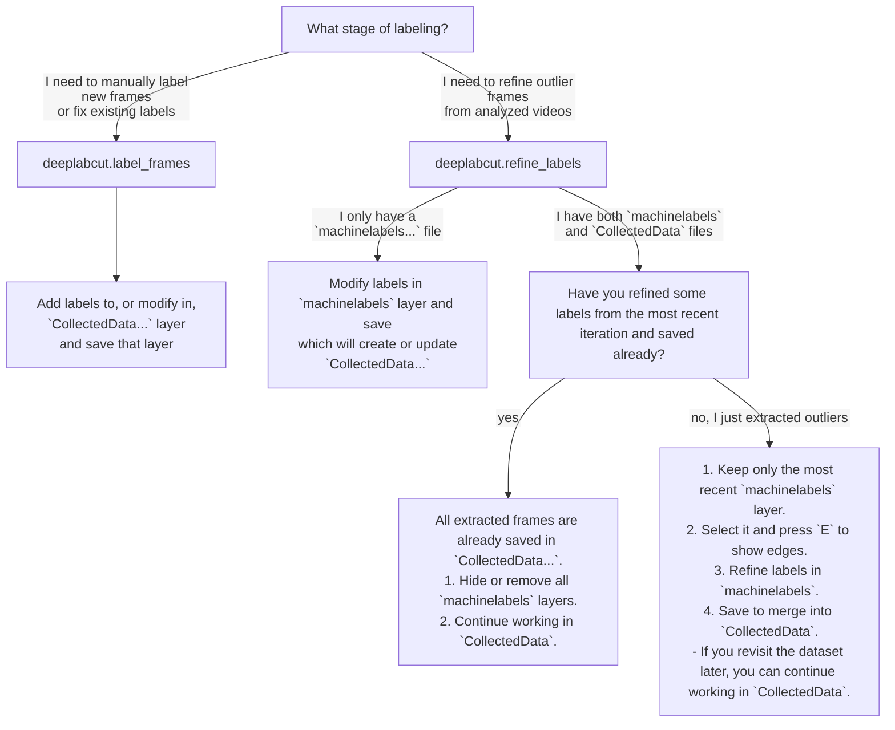

# napari-deeplabcut - Keypoint annotation tool for pose estimation


[📚 Plugin Documentation](https://deeplabcut.github.io/DeepLabCut/docs/gui/napari_GUI.html) |
[🛠️ DeepLabCut Installation](https://deeplabcut.github.io/DeepLabCut/docs/installation.html) |
[🌎 DeepLabCut Home Page](https://www.deeplabcut.org) |

[](https://www.gnu.org/licenses/lgpl-3.0)
[](https://pypi.org/project/napari-deeplabcut)
[](https://python.org)
[](https://github.com/DeepLabCut/napari-deeplabcut/actions)
[](https://codecov.io/gh/DeepLabCut/napari-deeplabcut)
[](https://napari-hub.org/plugins/napari-deeplabcut)

A napari plugin for keypoint annotation and label refinement, also used within DeepLabCut.

---

## Installation

If you installed `DeepLabCut[gui]`, this plugin is already included.

You can also install `napari-deeplabcut` as a standalone keypoint annotation plugin without using the full DeepLabCut GUI.

### Standard install

Using `pip`:

```bash
pip install napari-deeplabcut
```

Using `uv`:

```bash
uv add napari-deeplabcut
```

> [!NOTE]
> A conda environment is not strictly required. Please use your preferred package manager!

### Latest development version

Using `pip`:

```bash
pip install git+https://github.com/DeepLabCut/napari-deeplabcut.git
```

---

## Usage

Start napari:

```bash
napari
```

Then activate the plugin in:

> **Plugins → napari-deeplabcut: Keypoint controls**

Accepted files such as `config.yaml`, image folders, videos, and `.h5` annotation files can be loaded either by dragging them onto the canvas or through the **File** menu.

> [!TIP]
> The widget will open automatically when drag-and-dropping a compatible labeled data folder

### Recommended way to get started

The easiest way to start labeling from scratch is:

1. Open (or drag-and-drop) an image-only folder from your computer, or within a DeepLabCut project's `labeled-data` directory
  - This means that only the images are loaded, without any existing annotations
2. Open (or drag-and-drop) the `config.yaml` from your project

This creates:
- an **Image** layer with the images (or video frames), and
- an empty **Points** layer populated with the keypoint metadata from the config.

You may then start annotating in the points layer that was created.

> [!NOTE]
> If you load a folder from outside a DeepLabCut project and try to save a Points layer, you will be prompted to provide the config.yaml file
> used by the project. You may then move the labeled data folder into your project directory for downstream use.

[🎥 DEMO](https://youtu.be/hsA9IB5r73E)

---

## Tools and shortcuts

- `2` / `3`: switch between labeling and selection mode when a Points layer is active
- `4`: enable pan & zoom
- `M`: cycle through sequential, quick, and cycle annotation modes
- `E`: toggle edge coloring
- `F`: toggle between individual and body-part coloring modes
- `V`: toggle visibility of the selected layer
- `Backspace`: delete selected point(s)
- `Ctrl+C` / `Ctrl+V`: copy and paste selected points
- Double-click the current frame number to jump to a specific frame

> [!TIP]
> Press the "View shortcuts" button in the dock widget for a reference.

Additional dock controls include:

- **Warn on overwrite**: enable or disable confirmation prompts when saving would overwrite existing annotations
- **Show trails**: display keypoint trails over time in the main viewer
- **Show trajectories**: open a trajectory plot in a separate dock widget
- **Show color scheme**: display the active/configured color mapping reference
- **Video tools**: extract the current frame and store crop coordinates for videos

---

## Saving layers

Use:

> **File → Save Selected Layer(s)...**
>
or the shortcut:

```text
Ctrl+S
```

### Keypoint save behavior

Keypoint annotations are automatically saved into the corresponding dataset folder as:

```text
CollectedData_<ScorerName>.h5
```

For convenience, the companion `.csv` file is written in the same folder.

### Important notes

- DeepLabCut uses the **H5** file as the authoritative annotation file.
- Before saving, make sure the **Points** layer you want to save is selected.
  - The plugin will not save if several Points layers are selected at the same time, to avoid ambiguity.
- Saving a `machinelabels...` layer does **not** write back to the machine labels file.
  Instead, refined annotations are written into the appropriate `CollectedData...` file.
- If saving would overwrite existing annotations, the plugin will prompt for confirmation.
  - While labeling, confirmation can be disabled by unchecking the "Warn on overwrite" option in the dock widget.

---

## Video support

Videos can be opened directly in the GUI.

When a video is loaded, the plugin enables a small video action panel that can be used to:

- Extract the current frame into the dataset
- Optionally export existing machine labels for that frame
- Define and save crop coordinates to the DLC `config.yaml`

Keypoints in video-based workflows can be edited and saved in the same way as ordinary image-folder workflows.

---

## Workflow (outside of DLC GUI)

Suggested workflows depend on what is already present in the dataset folder.

Please note this describes the workflow when napari is launched as a standalone application, outside of the DeepLabCut GUI.

### 1) Labeling from scratch

Use this when the image folder does **not** yet contain a `CollectedData_<ScorerName>.h5` file.

1. Open a folder of extracted images
2. Open the corresponding DeepLabCut `config.yaml`
3. Select the created **Points** layer
4. Start labeling
5. Save the points layer with `Ctrl+S`

After saving, the folder should now contain:

```text
CollectedData_<ScorerName>.h5
CollectedData_<ScorerName>.csv
```

---

### 2) Resuming labeling

Use this when the folder already contains a `CollectedData_<ScorerName>.h5` file.

Open the folder in napari. The existing keypoint metadata and annotations will be loaded from the H5 file, so loading `config.yaml` is not needed nor recommended.

However, loading the config is still useful if:

- The project’s bodyparts changed
- you want to refresh the configured color scheme from the project config

---

### 3) Refining machine labels

Use this when the folder contains a machine predictions file such as:

```text
machinelabels-iter<...>.h5
```

Open the folder in napari.

If both a `CollectedData...` file and a `machinelabels...` file are present:

- Edit the `machinelabels` layer to refine predictions
- Optionally use edge coloring (`E`) to highlight low-confidence labels
- Save the selected `machinelabels` layer to merge refinements into `CollectedData`

If the folder contains only `machinelabels...` and no `CollectedData...`, refined annotations will still be saved into a new `CollectedData...` target.

---

## Workflow flowchart



---

## Labeling multiple image folders

Only one dataset folder should be worked on at a time.

After finishing a folder:

1. Save the relevant **Points** layer
2. Remove the current layers from the viewer
3. Open the next folder

This keeps plugin operation and saving unambiguous.

---

## Defining crop coordinates

To store crop coordinates in a DLC project:

1. Open the video from the project’s `videos` folder
2. Enable cropping in the video tools
3. Draw a rectangle in the newly created crop layer (the tool is selected by default)
4. Click **Store crop coordinates** after checking the coordinates in the widget.

The crop coordinates are then written back to the project configuration.

---

## Contributing

Contributions are welcome.

Tests can be run locally with [tox].
Please note we use pre-commit hooks to run linters and formatters on changed files, so make sure to install the pre-commit dependencies:

```bash
pip install pre-commit
pre-commit install
```

### Development install

Clone the repository and install it in editable mode.

Using `pip`:

```bash
pip install -e .
```

If you need development dependencies as well, use the project’s `dev` extra:

```bash
pip install -e .[dev]
```

## License

Distributed under the terms of the [LGPL-3.0](https://www.gnu.org/licenses/lgpl-3.0).

## Issues

If you encounter any problems, please [file an issue](https://github.com/DeepLabCut/napari-deeplabcut/issues) with a detailed description and, if possible, a minimal reproducible example.

## Acknowledgements

This [napari](https://github.com/napari/napari) plugin was originally generated with [Cookiecutter](https://github.com/audreyr/cookiecutter) using [@napari](https://github.com/napari)'s [cookiecutter-napari-plugin](https://github.com/napari/cookiecutter-napari-plugin) template.

We thank the Chan Zuckerberg Initiative (CZI) for funding the initial development of this work!

[tox]: https://tox.readthedocs.io/en/latest/
