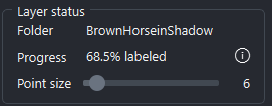
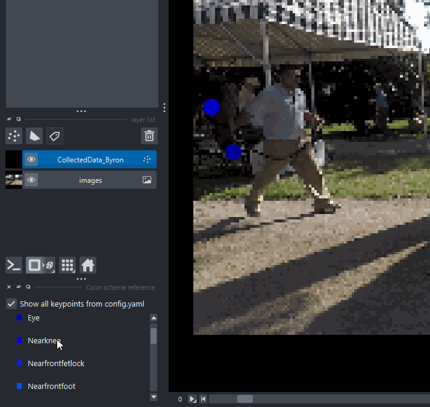
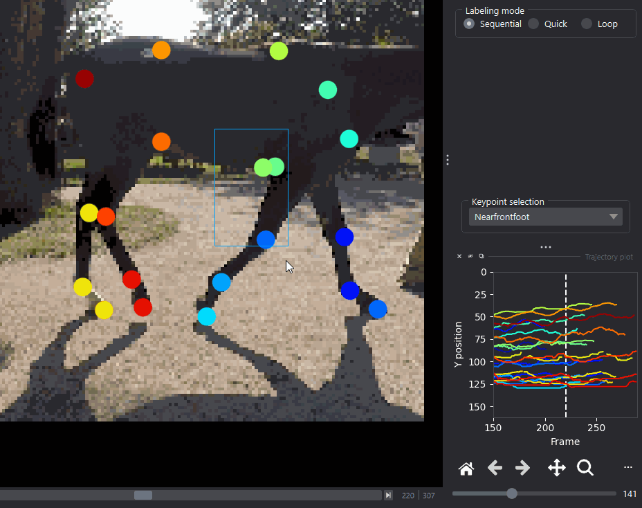
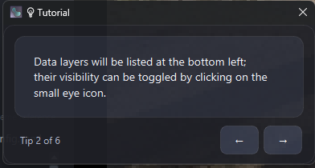
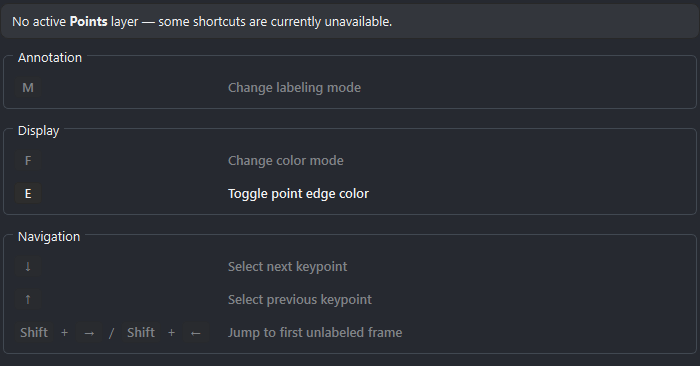
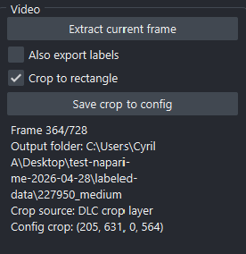
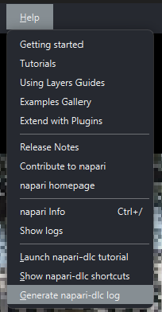

# napari-deeplabcut v0.3.0.0

This release brings a nearly-complete rewrite of the plugin, keeping a familiar UI and workflow but adding many new **safety improvements** around data loading/saving, **improved user experience** including more informative dialogs and issue reporting tools, and many **quality-of-life improvements**.

> [!IMPORTANT]
> As much of the basic workflow has been modified and updated, experienced users may have to adapt to the newest changes in the plugin, as we simplified data loading and saving. Expect a slight adjustment period as you get used to the new workflow, but we hope you will appreciate the streamlining and new features!

## New features

### UI additions

  
   
  <em>New status panel with folder, progress estimate, and point size slider</em>

- **New tooltip showing currently opened folder**
- **New "progress estimate" widget**, showing the estimated % frames labeled in the current folder.
  - > [!NOTE]
    > The estimate should be considered a relative progress metric, rather than a requirement to reach 100% on every folder, as the estimate cannot account for non-visible keypoints.
- **Global point size slider**:
  - Updates the size of all keypoints in the viewer
  - Saved to config.yaml automatically, and loaded on startup
  - One can still use the native napari point size slider for individual points, but this will not be persisted.

  
   
  <em>New color scheme display interactions</em>

- **Color scheme display improvements**:

  - Now only shows entries for keypoints on the current frame
  - Added a toggle to show all keypoints from config.yaml, even if they are not visible on the current frame
  - Clicking an entry now selects all matching keypoints in the frame
  - Clicking an entry in "Show all keypoints" mode will jump to the first frame where that keypoint is visible, and select all matching keypoints in that frame, if any.
  - Also works for multi-animal data:
    - Clicking an individual's entry will select all keypoints for that individual
    - Clicking on a bodypart entry will select all keypoints for that bodypart across all individuals

- **Fixed & improved trails**:

  - Trails now work properly in multi-animal data, showing trails for all individuals of the proper color
  - Basic visualization settings for trails are persisted across sessions

  
   
  <em>New trajectory plot interactions</em>

- **Fixed and improved trajectory plot**:
  - Colors are now dynamically updated to match individuals/bodyparts in the viewer
  - Selecting points automatically filters the plot to the selected individuals/bodyparts
  - Fixed Y coordinates to match napari viewer coordinates (top-left origin)

  
   
  <em>New tutorial</em>

  
   
  <em>New keyboard shortcuts</em>

- **Improved tutorial and keyboard shortcuts dialogs**
  - Keybinds are now dynamically shown if available, and document why they are enabled/disabled based on context
    - e.g. No Points layer -> Points navigation shortcuts are disabled
  - Updated tutorial visuals

  
   
  <em>New video frame extraction and cropping menu</em>

- **Improved video frame extraction and cropping**
  - Loading a video opens the usual Video Controls panel, now with additional contextual information
  - Checking "Crop with rectangle" immediately creates a Shapes layer and selects the rectangle drawing tool
  - Safer method for selecting which rectangle to use for cropping when multiple are present, and better handling of edge cases
  - Shows the crop coordinates as they will appear in config.yaml

  
   
  <em>New debug log generation utility</em>

- **Debug log generation utility**
  - Opening a Keypoint Controls dialog now adds a ***Help > Generate napari-dlc log*** option
  - Generates a copy-pastable log of relevant information about the plugin and napari environment, as well as latest debug messages, to help with debugging and issue reporting

### Data loading/saving fixes and improvements

- **Drag & drop loading is fixed!**
  - Now auto-opens Keypoint Controls on folder load
  - > [!IMPORTANT]
    > Users should not always add the config.yaml to the viewer when loading labeled data folders. The plugin now checks parent folders as per the canonical DLC project structure, and will automatically find and load the config.yaml if it is present in a parent folder.
  - When saving "project-less" annotations, the plugin may ask for a config.yaml if relevant, which will write annotations relative to the specified project. **Users should then move the resulting annotations folder back to the specified project.**
- **Copy-paste is fixed!**
- **Any save that would overwrite data now shows a confirmation dialog**
  - Can be disabled with the "Warn on overwrite" option in the Keypoint Controls, if one is labeling from scratch and requires faster saves
  - Saving machine labels now clearly shows that the CollectedData file will be modified, and warns about overwriting existing data if there are conflicts with existing labels
- Improved data loading checks and remapping of frames
  - Moving data between folders or machines should cause less issues with frame remapping, and the plugin should be able to recover from more types of data loading issues without crashing or incorrectly loading data.
- Loading a video and adding the config.yaml for the placeholder Points layer, and attempting to save, now warns about the missing frame extraction step, and offers a procedure to follow the DLC workflow more closely.
- Fixed several issues around config updates when refreshing by loading the config.yaml
- Attempting to open several labeled data folders at once now warns about only supporting one folder at a time, attempts to load annotations, and skips images/video frames from the new project, rather than ending up in an inconsistent state.

## Bug fixes

- Several bugs, edge cases and unsafe data handling have been fixed, and the plugin should be much more stable and less likely to crash or lose data.
- Reduced reliance on specific napari versions, and introduced a compatibility layer for any code that is closer to napari internals
  - Greatly reduced napari internals monkeypatching and API-specific code
- Better handling of moved paths, missing config, broken or partial HDF5 files, and other common issues that may arise when moving data around or working with multiple machines

## Code quality improvements

- Nearly complete rewrite of the plugin codebase, with a focus on modularity, readability, and maintainability
- Better separation of operations, vastly expanded testing, better documentation of plugin invariants and assumptions
  - Introduce pydantic models for various data structures, with validation and type checking to ensure data integrity and catch issues earlier
  - Better boundaries around UI updates, I/O operations and layer lifecycle management.
- Introduced a minimal deprecation system
- New debug contexts for monitoring performance and automated log generation

## Updated documentation

The newly updated documentation can be found [here](<>).

## Future directions

The codebase remains in a transitory state, with many improvements but still several areas that could use more consolidated logic, centralization around validated data models, and better abstraction of I/O formats to account for future changes in DLC projects.

As always, we welcome contributions and suggestions for improvements, and will continue to work on improving the plugin in future releases!

Feel free to add to [#184](https://github.com/DeepLabCut/napari-deeplabcut/issues/184) if you have any refactor-specific thoughts or suggestions.

Expect a focus on fixes and improvements shortly after this major update, followed by more features and improvements, such a automated point tracking for faster and more robust labeling.
